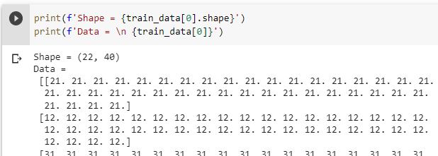

# regularized_lstm_and_attention

Intro to Deep Learning assignment:

## Regularized lstm

The first part of this assignment is to **predict the next word** and **generate text** for the `test` set from the pre-processed WikiText-2 Language Modeling Dataset by employing various techniques to **regularize** an LSTM model for better performance 

* The techniques are all from [Regularizing and Optimizing LSTM Language Models.pdf](https://arxiv.org/pdf/1708.02182.pdf)
* All the details for this part can be found in [hw4/training.ipynb](hw4/training.ipynb)
* [hw4/training.ipynb](hw4/training.ipynb) uses the class `LanguageModelTrainer` and the class `TestLanguageModel` to train on the `train` set, to print the **Negative Log Likelihood (NLL)** for the prediction task on the `train` and `dev` set, and then to predict and generate for the `test` dataset
* **Prediction of the Next Word**: In class `TestLanguageModel`, the function `prediction` takes as input a batch of sequences and returns the raw scores for the next word for each sequence 
> The prediction scores for the `dev` and `test` set are stored in [predictions-39.npy](1660560996/predictions-39.npy) and [predictions-test-39.npy](1660560996/predictions-test-39.npy) respectively
* **Generation of a Sequence**: In class `TestLanguageModel`, the function `generation` takes as input a batch of sequences and generates a sequence for each provided sequence 
> The generated texts for the `dev` and `test` set are stored in [generated-39.txt](1660560996/generated.txt) and [generated-39-test.txt](1660560996/generated-39-test.txt) respectively
* This model achieves **4.75** mean NLL score for prediction of the next word and **1.88** mean NLL for generation of a sequence on `test` set
### loss

  

## Attention plot
For this part, the goal is to implement a simple character-based **attention** model with teaching-forcing method to retrieve attention plots.

* The baseline model is a simplified version in the [Listen, Attend and Spell paper](https://arxiv.org/pdf/1508.01211.pdf?undefined) without the pyramid BLSTM layers.
* The model uses **dot-product attention** with one layer of Bi-LSTM in encoder and two LSTMCells in decoder.
* **Training features**: Random sequences of embedded characters, each of variable length and 40 frequency bands
* **Training labels**: Transcripts corresponding to the training features
> A screeshot of the first training feature (right) and its corresponding training label

 
 

* [attention_plots](attention_plots) stores the **attention plots** for the first 10 validation samples, which are also stored as numpy array in [attention.npy](attention.npy)
* The model details can be found in [attention.ipynb](attention.ipynb)

